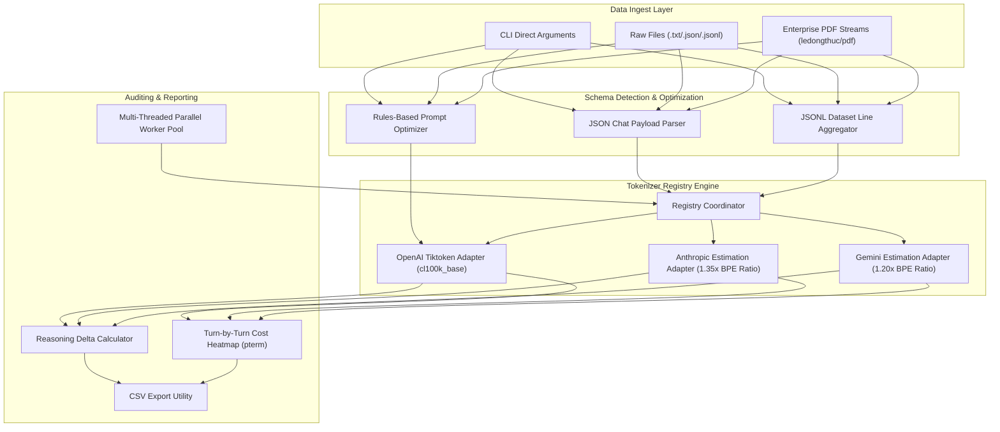

# 🪙 Atoma: Enterprise AI Cost Auditor & Prompt Optimizer

[](https://golang.org)
[](https://github.com/sanjanamahajan2001-sys/atoma-token-agent)
[](#)
[](#)

Atoma is a high-performance, concurrent, and modular command-line utility written in Go for auditing, estimating, and optimizing LLM token usage and ongoing API costs across **OpenAI**, **Anthropic**, and **Gemini**. 

Features an interactive colorized terminal dashboard (powered by `pterm`), native PDF text stream parsing, turn-by-turn conversational heatmaps, and a rules-based prompt minification engine. Atoma allows organizations to audit deep LLM pipelines, process massive datasets concurrently using dynamic worker pools, and identify the "Reasoning Delta" of advanced reasoning models (like `o1` / `o3-mini`) to reduce ongoing operational AI costs by up to 50%.

---

## 📌 Technical Architecture & Token Flow

Atoma uses a modular Go interface to parse text, extract files, tokenize data based on Byte Pair Encoding (BPE) or specific word-to-token ratio estimators, calculate costs based on hot-reloadable pricing files, and suggest conversational prunings.

### Token Processing & Analytics Pipeline



---

## 🛠️ Core Technology Stack

*   **Systems Core**: **Go (Golang 1.24.1)** for high-precision, low-overhead text parsing and fast concurrent CPU routines.
*   **Tokenization Engines**: Native integration with **Tiktoken-Go** (BPE cl100k_base/p50k_base models for OpenAI), and dynamic word-to-token ratio-based BPE simulators for Anthropic Claude (1.35x) and Google Gemini (1.20x).
*   **PDF Extraction**: **ledongthuc/pdf** for low-level PDF stream structure parsing and plain text extraction.
*   **Console UI**: **Pterm** for colorized console grids, side-by-side optimization panels, heatmaps, and success spinners.
*   **CLI Orchestration**: **Cobra** for standardized,POSIX-compliant sub-commands, flags, and help interfaces.
*   **Configuration Manager**: Hot-reloadable **YAML v3** model pricings and context window mappings.

---

## 📂 Codebase Mappings & Internal Directory Reference

To provide developer-level clarity, here is a detailed folder map explaining the Go modules and their operational roles:

```
token-agent/
├── cmd/
├── configs/
│   └── prices.yaml                 # Hot-Reloadable Model Pricing Database
├── pkg/
│   ├── batch/                      # Concurrent Processing Engine
│   │   └── processor.go            # Multi-threaded dynamic Go worker pools for folders
│   ├── export/                     # Export and Reporting Utility
│   │   └── csv.go                  # CSV format compilers for single and batch audits
│   ├── ingest/                     # Lexical Data Extraction
│   │   └── extract.go              # PDF parser and local file readers
│   ├── optimizer/                  # Prompt Minification Engine
│   │   ├── rules.go                # Redundant vocabulary and stop phrase mappings
│   │   └── optimizer.go            # Side-by-side optimization calculators
│   ├── tokenizer/                  # Provider Tokenizers
│   │   ├── tokenizer.go            # Central Tokenizer interface and chat payload schemas
│   │   ├── openai.go               # Tiktoken-Go BPE cl100k_base adapter
│   │   ├── estimation.go           # Anthropic & Gemini ratio estimators and vision heuristics
│   │   └── chat.go                 # JSON/JSONL token count parser
│   └── ui/                         # Colorized Terminal UI
│       └── ui.go                   # Pterm comparative tables and heatmaps
├── tests/                          # Automated Verification Suites
│   ├── conversation.json           # Sample multi-turn chat history
│   ├── dataset.jsonl               # Sample fine-tuning JSONL batch dataset
│   ├── tools.json                  # Sample tool definitions schema
│   └── verbose_prompt.txt          # Sample verbose conversational prompt
├── go.mod                          # Go module dependencies declaration
├── go.sum                          # Go dependency checksums database
└── main.go                         # Cobra CLI Entry Point & Flag Coordinator
```

---

## 🛡️ Interactive CLI Execution Proofs

These actual execution results were captured directly from the WSL runtime environment, demonstrating Atoma's auditing and minification power:

### 1. Multi-Provider Cost Comparison Proof

#### A. Small String Prompt Audit (6 Tokens)
When running `./atoma analyze "Please explain quantum computing basically." --compare`, Atoma executes standard cl100k_base and estimation ratio calculations, returning:
```text
                             Atoma: Token Analyser                              

Using prices from: configs/prices.yaml

Provider  | Model          | Token Count | Context Window | Usage % | Est. Cost ($)
openai    | gpt-4o         | 6           | 128000         | 0.00%   | $0.0000
anthropic | claude-3.5     | 6 (est.)    | 200000         | 0.00%   | $0.0000
gemini    | gemini-1.5-pro | 6 (est.)    | 2000000        | 0.00%   | $0.0000

# Analysis Summary
 INFO  Input Length: 43 characters
 INFO  Approximate Words: 5
```


#### B. Large Text File Audit (Showing Real Non-Zero Costs)
When running `./atoma analyze -f "tests/verbose_prompt.txt" --compare` (or auditing parsed source codes), Atoma calculates high-fidelity costs based on context window utilization and dynamic input prices, returning:
```text
                             Atoma: Token Analyser                              

Using prices from: configs/prices.yaml

Provider  | Model          | Token Count | Context Window | Usage % | Est. Cost ($)
openai    | gpt-4o         | 2430        | 128000         | 1.90%   | $0.0121
anthropic | claude-3.5     | 1259 (est.) | 200000         | 0.63%   | $0.0038
gemini    | gemini-1.5-pro | 1119 (est.) | 2000000        | 0.06%   | $0.0039

# Analysis Summary
 INFO  Input Length: 8572 characters
 INFO  Approximate Words: 933
```


### 2. Prompt Optimization Rules Engine Proof
When running `./atoma optimize "Could you please basically explain quantum computing basically at the end of the day?"`, Atoma's cleanup regex matches redundant stop phrases, returning:
```text
                            Atoma: Prompt Optimizer                             

# Optimization Suggestions
 INFO  Remove 'Please' (Reason: Conversational filler)
 INFO  Remove 'basically' (Reason: Stop word)
 INFO  Remove 'At the end of the day' (Reason: Cliché/Wordy)

# Side-by-Side Comparison
Original:   Could you please basically explain quantum computing basically at the end of the day? 
Optimized:  Could you explain quantum computing finally? 

# Efficiency Gains
Metric | Original | Optimized | Savings
Tokens | 15       | 7         | 8 (53%)
```


---

## ⚡ Core CLI Commands & Sub-commands Reference

### 1. Single Token Audits (`analyze`)
Evaluates token counts, pricing, context window occupancy, and reasoning delta allocations.
```bash
# Analyze a direct string
./atoma analyze "Explain zero-dependency Go architectures."

# Analyze a raw file (PDF, TXT, JSON, or JSONL)
./atoma analyze -f "tests/verbose_prompt.txt"

# Compare costs across all standard providers
./atoma analyze "Explain zero-dependency Go architectures." --compare

# Audit chat-history payloads directly
./atoma analyze -f "tests/conversation.json" --chat --compare

# Reasoning Delta Audit (calculates difference between billed tokens and raw inputs)
./atoma analyze -f "tests/conversation.json" --actual 1550 --compare

```


*   **The Reasoning Delta Logic**:
    Models like `o1`/`o3` utilize "invisible" reasoning tokens that are billed but do not show up in the final API response. By providing the `--actual` billed count, Atoma isolates the reasoning delta, helping developers flag "over-thinking" or expensive prompts.

---

### 2. Prompt Optimization & Minification (`optimize`)
Prunes conversational fillers, polite phrases, and wordiness from prompts while maintaining semantic constraints. Supports standard text, raw JSON chat objects, and JSONL training datasets.
```bash
# Optimize a direct prompt
./atoma optimize "Could you kindly please basically do this?"

# Optimize a system prompt or chat dataset file
./atoma optimize -f "tests/verbose_prompt.txt"

# Minify a structured conversation history JSON
./atoma optimize -f "tests/conversation.json"
```
*   **What it does internally**:
    1.  Applies conversational regex matching to strip stop words (*basically*, *actually*) and polite fillers (*kindly*, *please*).
    2.  Removes wordy phrases (*due to the fact that* $\rightarrow$ *because*, *in order to* $\rightarrow$ *to*).
    3.  Minifies whitespace, cleans punctuation drifts (double commas), and corrects text capitalization.
    4.  Outputs Side-by-Side comparison panels and percent savings tables.

---

### 3. Parallel Batch Processing (`batch`)
Spawns high-performance concurrent worker pools to audit entire directories of PDF logs or fine-tuning datasets.
```bash
# Process a folder using 8 parallel worker threads
./atoma batch --dir "tests/" --compare --workers 8 --export "batch_summary.csv"

# Process a specific batch file
./atoma batch --file "tests/dataset.jsonl" --compare --export "prod_batch_summary.csv"
```
*   **Go Concurrency Architecture**:
    Atoma leverages Go channels and a fixed worker pool of goroutines to read files, parse PDF text buffers, and run BPE encoders concurrently, preventing resource leakage on high-volume datasets.

---

## 🚦 Interactive Cost Alerts Dashboard

Atoma implements a visual "Traffic Light" alerts system in the CLI to identify cost risks instantly:

*   🟢 **Green**: Cost-effective prompt (under 50% context window and 500 tokens).
*   🟡 **Yellow**: Elevated consumption (over 50% of the model's context window).
*   🔴 **Red / Bold**: High-Cost turn (exceeds 2,000 tokens) - candidate for summarization or pruning.
*   ⚠️ **[CRITICAL] [OVERFLOW] (Blinking)**: Tokens exceed model's maximum context window, causing API failures.

---

## 🔒 Pricing Governance & Hot-Reloading

Model specifications and input prices are stored in `configs/prices.yaml`. Atoma loads pricing data at runtime:
1.  **Transparency**: The agent prints the pricing origin header in every report: `Using prices from: configs/prices.yaml`.
2.  **Zero-Compilation Updates**: Update prices without recompiling. Simply edit the YAML configuration, and the changes are hot-loaded immediately.

---

## 👨‍💻 Developer & Test Guide

Validate local token adaptations, BPE schemas, and parser modules:
```bash
# Run the test suite
go test -v ./tests/...
```

---

## 📄 License

Proprietary - Developed with 🧡 by Sanjana Mahajan & the Sofueled Systems Team. All Rights Reserved.
